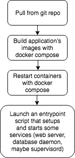
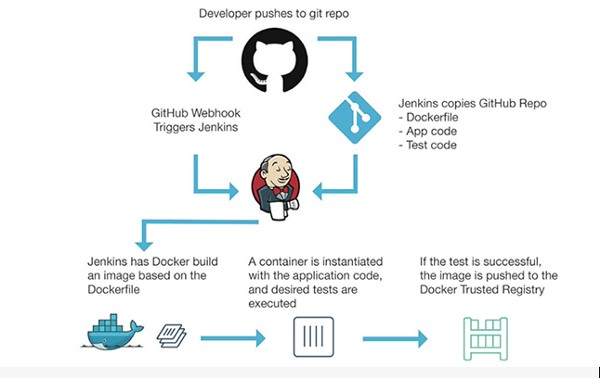

A couple of years ago I heard for the first time about this new technology
called “Docker”. I was intrigued, because I liked ideas like isolating
application’s environments and I wanted to see how I could apply it to my
day-to-day work as a software developer. I decided to start reading about it,
and I also attended some local meet-ups. The thing is… these meet-ups were
fantastic, but they were more oriented to a systems administrators rather than
developers. The speakers talked about large production deployment with Docker
and other tools like OpenShift, Chef, Puppet, Kubernetes, etc. This was actually
quite awesome, but no exactly what I was looking for.

First things first: if you don’t know anything about Docker, I’d recommend
reading the starting guide first, so you understand the main concepts (images,
containers vs VMs, volumes, etc.):
[https://docs.docker.com/get-started/](https://docs.docker.com/get-started/)

#### Abstracting away each project’s stack

So I gave it a try and started introducing Docker to my workflow. I really
wanted to see how much I could take from it. I mainly work with web and mobile
applications so there’s almost always some kind of back-end technology in my
projects. In my case, I had to work with Python, Node.js and PHP back-ends. The
first thing I wanted from Docker, was the ability of rapidly swapping
development environments, so I could fix a specific bug in a different project
with a different tech stack without struggling with environment setup ! If
you’re a freelance worker, you probably face this kind of scenarios frequently.

I started working and created an image for each project encapsulating all
back-end, front-end, and database dependencies into a single container for each
project. Docker never “complained” about my approach and it let me do whatever I
wanted, even if I wasn’t doing the **best thing**. This proved to me that Docker
is quite versatile. The thing about **versatile **technologies is that you need
to dig deeper to really take advantage of it. It is way too easy to do things
wrong. And this is what I was doing, creating big, monolithic images that had a
number of issues. Soon, I realized that I hadn’t read enough about the best
practices. After reading [this piece of
documentation](https://docs.docker.com/engine/userguide/eng-image/dockerfile_best-practices/)
I started to understand how docker applies concepts like infrastructure
modularization:

> Decoupling applications into multiple containers makes it much easier to scale
> horizontally and reuse containers. For instance, a web application stack might
consist of three separate containers, each with its own unique image, to manage
the web application, database, and an in-memory cache in a decoupled manner.

#### Modularizing services from the applications

I then started using Docker Compose, which is a great native tool to declare
different “services” (different containers), tipically in a Yaml file. If you
haven’t heard of it, basically the idea is that you define in the docker-compose
file your application containers and how they run instead of doing this manually
in a bash command. This means that you define for each container things like
port binding, environment variable files, ports exposed, volumes, and images,
between others. Altogether, these “services” compose the application that is
treated as a whole by the “docker-compose” CLI tool. I had finally isolated all
my project’s dependencies, and modularized them into a multi-container docker
app successfully.

You should take this note: Don’t expect “docker” and “docker-compose” CLI tools
to behave exactly the same. Also, read about the differences between starting
your application with “docker-compose up” and “docker-compose run”:

> Typically, you want `docker-compose up`. Use `up` to start or restart all the
> services defined in a `docker-compose.yml`. In the default “attached” mode,
you’ll see all the logs from all the containers. In “detached” mode (`-d`),
Compose exits after starting the containers, but the containers continue to run
in the background.

> The `docker-compose run` command is for running “one-off” or “adhoc” tasks. It
> requires the service name you want to run and only starts containers for
services that the running service depends on. Use `run` to run tests or perform
an administrative task such as removing or adding data to a data volume
container.

I recommend you to read these docs about Compose:

* [https://docs.docker.com/compose/faq/#whats-the-difference-between-up-run-and-start](https://docs.docker.com/compose/faq/#whats-the-difference-between-up-run-and-start)
* [https://docs.docker.com/compose/overview/#compose-documentation](https://docs.docker.com/compose/overview/#compose-documentation)

#### What about using Docker to deploy staging or production environments?

This was yet another **fantastic** benefit of using this tool. Not only I can
run my app virtualized in a modular and manageable way and not care about the
{Insert language/framework} version it is using, but also I can **work in an
environment that I know it will be similar to staging or production**, giving me
much confidence of what I’m building. I explicitly say “similar” because of
course there are going to be some differences for security or performance
reasons.

To achieve this, I started worked in an automated workflow that looked like
this:

It looked very promising to me. All these tasks were performed from some shell
scripts **automating** **the deployment process, **making it really easy to
rapidly push fixes or new features to other environments. However, I was
repeating my first mistake. Docker lets you do this without any problem, but it
is not intended to be used this way. You’re not supposed to pull and build from
all environments all the time ! Be careful because **image building takes up a
lot of disk space**.

Example CI workflow

Instead, if you want to achieve some sort of Continuous Integration / Continuous
Delivery workflow you should start by building and pushing your images to some
registry such as Docker Hub. After that, it is up to you or your organization
how you’ll build custom pipelines with other services (Jenkins, Github, AWS,
etc.). I may explore some of these options in the future and write about it in a
different article.

#### From a management point of view

In the last months I got to realize that a lot of time is wasted in projects
when the people involved change. Every time a new developer is introduced to a
team or project, we are wasting an awful amount of time of both the experienced
developer and the new one. Sometimes the “ramp-up” process takes days to only be
able to RUN the application locally, depending on the complexity of course. More
often, team members use different operating systems, making this task harder.

With Docker, I think all these things change drastically, making our teams more
dynamic and fast-moving. The new developer wouldn’t have to care about
infrastructure, or environment setup. He/she can start solving real issues very
soon, and the “ramp-up” time can be invested in more important things like
business rules, use cases, application architecture, etc.

#### A note on Mac OS-X

I’ve been working on OS-X most of the time, and lately I’ve noticed performance
issues with some projects that have heavy I/O disk access, especially in mounted
volumes. I started to investigate a little further, and found a couple of
articles/threads that explaining the issue in detail. Basically, there’s a major
difference in how Docker runs on Mac compared to GNU/Linux, and how it
synchronizes host’s and guest’s filesystems. Consider reading more about it if
you or your team members use mac:

* [https://spin.atomicobject.com/2017/06/20/docker-mac-overcoming-slow-volumes/](https://spin.atomicobject.com/2017/06/20/docker-mac-overcoming-slow-volumes/)
* [https://www.reddit.com/r/docker/comments/59u1b8/why_is_docker_so_slow_on_mac/](https://www.reddit.com/r/docker/comments/59u1b8/why_is_docker_so_slow_on_mac/)
* [https://medium.freecodecamp.org/speed-up-file-access-in-docker-for-mac-fbeee65d0ee7](https://medium.freecodecamp.org/speed-up-file-access-in-docker-for-mac-fbeee65d0ee7)

#### Finishing!

I hope my experience with Docker gives you some idea of how you could
incorporate it in your projects as part of your development workflow. From my
perspective, this is a tool that’s not suitable for every single project, but it
fits a large amount of them. In spite of being a relatively new and
fast-evolving technology, I found it to be stable enough to my needs.

Using Docker makes infrastructure more manageable, and gives you awesome
benefits like isolating dependencies, rapidly switching environments, fast
moving teams, deployment automation, and “deployment confidence”.
