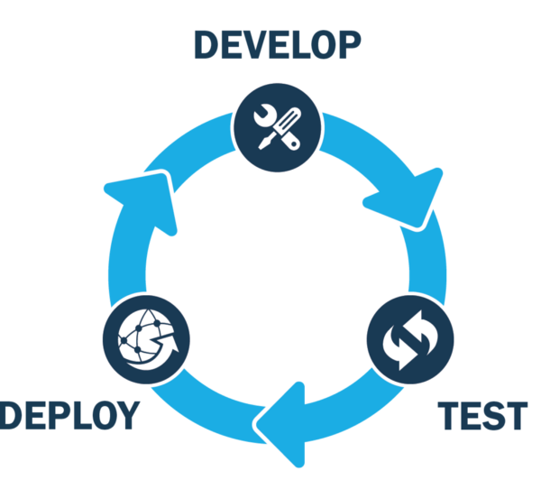

<span class="figcaption_hack">Photo by [Brooke
Lark](https://unsplash.com/photos/W1B2LpQOBxA?utm_source=unsplash&utm_medium=referral&utm_content=creditCopyText)
on
[Unsplash](https://unsplash.com/search/photos/shop-online?utm_source=unsplash&utm_medium=referral&utm_content=creditCopyText)</span>

This is a quick story about how I created a simple but end-to-end e-commerce
scraping web application called** “crawl-io”**. The goal behind this article is
to provide an example of an implementation so that other projects can borrow
ideas from it. The tech stack I picked for the job was MERN. Of course, keep in
mind that this article only reflects my personal experience and opinions. I’m
going to place Gists and Screenshots across the article, but [check the actual
repo](https://github.com/agustinaliagac/crawl-io) in case some of it gets
outdated. One final warning: the language of the UI text is Spanish and the
crawled sites are from my country (Argentina), only beacuse I didn’t get the
time to add others yet. The code and the concepts apply for any other e-commerce
site as well.

### What does “crawl-io” do exactly ?

The purpose of this application is quite simple. It allows the user to type in a
specific product name, to crawl multiple e-commerce sites and asynchronously
return useful results to the user. Some cool stuff that I didn’t include because
of lack of time are custom filtering and caching.

### UI and Architecture

#### Building the front end

To make it short, the front end is really small (only two pages: one for the
search box and another one for the results). The application only uses
client-side rendering. This could be considered as a flaw in terms of SEO, but
it wasn’t really important in this case. React.js was really useful to create
the base components (with a little magic of MaterialUI). The UI itself is not
gorgeous at all, but user friendly enough. Take a look:


I added an “infinite scrolling” feature to avoid memory leaks on the browser and
crashes in the application when the user receives hundreds of results.


Even though this app is small, I wanted to take care of state management outside
of React itself. That’s where [Redux](https://redux.js.org/) came in handy. In
case you’re not familiar with it, [Redux](https://redux.js.org/) is a popular
library in the React community that takes care of application state by applying
concepts from Facebook’s Flux pattern. And it does the job great. I created two
stores, separating the app in two main modules: Search and Results. I decided to
use the “ducks pattern” because I used it in other projects and I liked its
ending structure. Basically, this pattern consists in putting reducers, action
creators and thunks from a same module in a single file. I moved everything from
‘search term’ to ‘search results items’ into Redux’s state, thus making the code
structure cleaner and nicer. [Read more about the ducks pattern here
!](https://github.com/erikras/ducks-modular-redux) Asynchronous execution was
taken care of by Redux Thunk. Here’s the Search Results module file:

```javascript
import io from 'socket.io-client';
import { http } from '../../api/Services';
import { networkActionCreators } from '../Network';
import strings from '../../strings';
import rank from '../../utils/rank';

let resultsSocket;
const SNACKBAR_DELAY = 2200;

const INITIAL_STATE = {
  searchResults: [],
  searchUUID: '',
  notificationOpen: false,
  notificationText: '',
};

const actionTypes = {
  APPEND_SEARCH_RESULTS: 'crawlio/SearchResults/APPEND_SEARCH_RESULTS',
  UPDATE_SEARCH_UUID: 'crawlio/SearchResults/UPDATE_SEARCH_UUID',
  START_SEARCHING: 'crawlio/SearchResults/START_SEARCHING',
  SHOW_NOTIFICATION: 'crawlio/SearchResults/SHOW_NOTIFICATION',
  HIDE_NOTIFICATION: 'crawlio/SearchResults/HIDE_NOTIFICATION',
};

const actionCreators = {
  appendSearchResults: (results, searchTerm) => ({
    type: actionTypes.APPEND_SEARCH_RESULTS,
    payload: {
      results,
      searchTerm,
    },
  }),
  updateSearchUUID: uuid => ({
    type: actionTypes.UPDATE_SEARCH_UUID,
    payload: uuid,
  }),
  startSearching: () => ({
    type: actionTypes.START_SEARCHING,
  }),
  showNotification: text => ({
    type: actionTypes.SHOW_NOTIFICATION,
    payload: text,
  }),
  hideNotification: () => ({
    type: actionTypes.HIDE_NOTIFICATION,
  }),
};

const thunks = {
  searchTerm: term => (
    async (dispatch) => {
      dispatch(networkActionCreators.updateLoadingState(true));
      dispatch(actionCreators.startSearching());

      const response = await http.search(term);
      const { uuid } = response.data;

      dispatch(actionCreators.updateSearchUUID(uuid));
      dispatch(thunks.initializeWebSocket(term));
    }
  ),
  initializeWebSocket: term => (
    async (dispatch, getState) => {
      resultsSocket = io.connect(`${process.env.REACT_APP_WEBSOCKET_HOST}`, {
        query: {
          uuid: getState().results.searchUUID,
        },
      });
      resultsSocket.on('results', (data) => {
        console.log('received results', data);
        dispatch(actionCreators.appendSearchResults(data.results, term));
        if (getState().results.notificationOpen) {
          setTimeout(() => {
            dispatch(actionCreators.showNotification(strings.snackbarResults(data.providerName)));
          }, SNACKBAR_DELAY);
        } else {
          dispatch(actionCreators.showNotification(strings.snackbarResults(data.providerName)));
        }
      });
      resultsSocket.on('finished', () => {
        dispatch(networkActionCreators.updateLoadingState(false));
      });
    }
  ),
};

export {
  actionTypes as searchResultsActionTypes,
  actionCreators as searchResultsActionCreators,
  thunks as searchResultsThunks,
};

export default (state = INITIAL_STATE, action) => {
  switch (action.type) {
    case actionTypes.APPEND_SEARCH_RESULTS:
      return {
        ...state,
        searchResults:
          rank([...state.searchResults, ...action.payload.results], action.payload.searchTerm),
      };
    case actionTypes.UPDATE_SEARCH_UUID:
      return {
        ...state,
        searchUUID: action.payload,
      };
    case actionTypes.START_SEARCHING:
      return {
        ...state,
        searchResults: [],
      };
    case actionTypes.SHOW_NOTIFICATION:
      return {
        ...state,
        notificationOpen: true,
        notificationText: action.payload,
      };
    case actionTypes.HIDE_NOTIFICATION:
      return {
        ...state,
        notificationOpen: false,
        notificationText: '',
      };
    default:
      return state;
  }
};
```

#### Did I need Redux at all in the first place?

Short answer: no. Longer answer: this project probably wasn’t large enough to
justify the usage of this library. However, I wanted to create and end-to-end
sample product, and I considered this appropriate. The beauty of Redux is that
you can move your state from components to actual stores, making your
architecture more reliable, consistent and scalable.

#### Moving to the back end

The back end of the project is also tiny, yet powerful. From crawl-io’s
perspective, there are two types of sites: the ones that include a REST API for
searching and the ones that don’t. I called all of them **providers**.

The ‘data-providers’ directory contains this information about the sites: What
are their names? What type of sites are they? Which are the CSS Selectors to
retrieve the data? Which is the endpoint that I need to call if it’s a REST API?
All these questions get an answer in a separate provider file. A separate
function constructs the object that describes all the necessary data. This
collection of functions gets copied in build time to the front end side in order
to add dynamic filtering. Here’s a sample provider file:

```javascript
var { plusURLEncoder } = require('../urlEncoders');

var alamaula = function (config) {
  return {
    providerType: 'scrapper',
    providerData: {
      name: 'AlaMaula',
      image: 'https://pulsosocial.com/wp-content/uploads/2011/12/alamaula-alta-resolucion-e1323201111244.png',
      url: `https://www.alamaula.com/s-${plusURLEncoder(config.searchTerm)}/v1q0p1`,
      itemSelectors: {
        topSelector: '.result.pictures',
        title: '.title a',
        price: '.amount',
        link: '.title a@href',
        thumbnail: '.thumb img@data-src',
      },
      pagination: {
        selector: '.pagination a.next.follows@href',
        limit: config.paginationLimit,
      },
    },
  };
};

module.exports = alamaula;
```

When a search request is received on the Node.js side, we’re launching
“concurrent” search processes for all providers. Those functions get mapped to
Promises and we notify the results to the front end using WebSockets just as the
Promises get resolved. This means that the user gets to see dynamic content in
real time. The promises can be resolved by using either a scraper function or a
rest-client function, which are implemented with X-Ray and Axios respectively.
The whole process of scraping websites takes a lot of RAM memory, so I had to
tweak the starting command to increase the heap limit for Node.js. In the middle
of this process, we create a UUID to match the session with the search request
itself, allowing the front end to listen to the right events. Here’s what the
search function looks like:

```javascript
var providerCreators = require('../../../data-providers');
var restClient = require('./restClient');
var scrapper = require('./scrapper');
var { getSession } = require('../sessions');

/* eslint-disable no-param-reassign */
var search = function (searchTerm, uuid) {
  var promises = [];

  var providers = (function createProviders() {
    return Object.keys(providerCreators).map(item => (
      providerCreators[item]({
        searchTerm,
        paginationLimit: 3,
      })
    ));
  }());

  providers.forEach(function (prov) {
    if (prov.providerType === 'scrapper') {
      promises.push(scrapper(prov));
    } else if (prov.providerType === 'rest') {
      promises.push(restClient(prov));
    }
  });

  promises.forEach(function (pr, index) {
    Promise.resolve(pr).then(function (results) {
      promises.splice(index, 1);
      if (getSession(uuid)) {
        getSession(uuid).emit('results', results);
        if (promises.length === 1) getSession(uuid).emit('finished');
      }
    })
      .catch(function (error) {
        console.error(error);
        promises.splice(index, 1);
        if (getSession(uuid) && promises.length === 1) {
          getSession(uuid).emit('finished');
        }
      });
  });
};

module.exports = search;
```

### Implementation details

#### Search results ranking algorithm

Ranking results is an essential piece of any search system. It’s what will make
the application useful to the user or complete garbage.

Say we want to search for some product like “laptop”. It’s likely that I don’t
want to see things like “laptop screen” or “laptop charger” at the top of the
page. Even though they have some words in common, they are completely different
objects. How can we take care of that despite of not having control over the
providers’ search algorithms? Some other problematic factors include:

* Not having pre-stored information that could be useful to make predictions.
* Each result item consisting only of the following data: title, price, URL and
thumbnail.

My conclusion was to use a weighted ranking algorithm. By using multipliers with
different values, we can modify each item’s weight according to what we consider
to be relevant or not. I used two multipliers:

1.  The closeness of the price to a central value which I called “positional
reference”. This value is calculated as an average between the arithmetic mean
and the median, because I considered it was representative enough.
1.  The inclusion of the search term in the title. Believe it or not, some sites
would return a “Fridge” when looking for a “Smartphone”.

Finally, this is what the algorithm looks like:

```javascript
const calcMedian = (values) => {
  values.sort((a, b) => a - b);
  const lowMiddle = Math.floor((values.length - 1) / 2);
  const highMiddle = Math.ceil((values.length - 1) / 2);
  return (values[lowMiddle] + values[highMiddle]) / 2;
};

const calcMinAndMax = (values) => {
  values.sort((a, b) => a - b);
  return {
    MIN: values[0],
    MAX: values[values.length - 1],
  };
};

/* eslint-disable no-return-assign, no-param-reassign */
const calcAverage = (values) => {
  const sum = values.reduce((previous, current) => {
    if (typeof current === 'number' && !Number.isNaN(current)) {
      current += previous;
    }
    return current;
  });
  return sum / values.length;
};

const STATIC_MULTIPLIERS = {
  TITLE: {
    CONTAINS_TERM: 0.9,
    DOES_NOT_CONTAIN_TERM: 0.3,
  },
};

const calcItemWeight = (searchTerm, item, positionalRef, MAX) => {
  let coeficient = 1;
  if (item.title && typeof item.title === 'string') {
    if (item.title.includes(searchTerm)) {
      coeficient *= STATIC_MULTIPLIERS.TITLE.CONTAINS_TERM;
    } else {
      coeficient *= STATIC_MULTIPLIERS.TITLE.DOES_NOT_CONTAIN_TERM;
    }
  }

  const { price } = item;
  const proximityMultiplier = price <= positionalRef ?
    price / positionalRef :
    (MAX - price) / (MAX - positionalRef);

  coeficient *= proximityMultiplier;

  return coeficient;
};

/*
* Simple algorithm that puts a weight value in each array item,
* so that we can sort items in a more useful way.
* Relevancy factors are closeness to median/avg values and title containing the keyword.
*/
export default (items, searchTerm) => {
  if (!items || !items.length) {
    return items;
  }
  const values = items.map(i => Number.parseFloat(i.price));
  const median = calcMedian(values);
  const avg = calcAverage(values);
  const { MAX } = calcMinAndMax(values);

  const positionalRef = (median + avg) / 2;

  items.forEach((item) => {
    item.weight = calcItemWeight(searchTerm, item, positionalRef, MAX);
  });

  items.sort((a, b) => b.weight - a.weight);

  return items;
};
```

#### ES5 or ES6 ?


If you ever read the project’s code, you’ll notice it doesn’t use the same
standards across the whole project. That’s because I wanted to showcase both ES6
on React.js and ES5 (with bits of ES6) on Node.js.

ES6 brings good features to the table, such as classes, arrow functions,
block-scoped variables, template literals, enhanced object literals, object
destructuring, default function arguments, etc. However, I thought it would be
interesting to stick a little bit with ES5 on the back end to showcase the
differences.

#### Linting and Unit Testing

ESLint was the perfect choice to do some Linting in the project. The project
extends Airbnb’s Lint config. Moreover, the VSCode plugin for ESLint works
extremely well. Unit testing was done by using Jest on React.js and Mocha on
Node.js. It was interesting for me to use something like Chai, which allows us
to write expressions in a way similar to natural language.

#### Data storage

Crawl-io retrieves data in real time. There’s no database to pull the
pre-indexed data from. What I did is to save each pair of results-selection in a
MongoDB collection. In a more complete implementation, that data could be useful
for some sort of Machine Learning algorithm to predict the most useful way to
rank results.

#### A useful CI/CD Pipeline



My CI/CD pipeline consists in these steps:

* Running all tests from React and Node
* Building a Docker image and [deploying it to Docker
Hub](https://hub.docker.com/r/agustinaliagac/crawlio/)
* Deploying the project in VPS server through SSH

All of this runs [on a public CircleCI
job](https://circleci.com/gh/agustinaliagac/crawl-io/). I could have picked
TravisCI, Jenkins or others. But it had a good free plan for open source
projects, which supports docker builds, so I went with it.

As I wrote in my previous [article about Docker from a developer’s
perspective](https://medium.com/@agustin.aliaga/how-docker-worked-for-me-as-a-software-developer-58a049f132ff),
I **really** like Docker. I must add that it was delightful to run my scraper
image inside a set of different containers with Docker Compose. I didn’t really
get to use Swarm or Kubernetes because they exceeded my needs. I got to run my
app in a controlled environment, with other cool services like Nginx or MongoDB
without having to install them in my local machine.

#### Unsolved challenges

Some sites heavily use front end frameworks and do AJAX calls, which makes it
harder for the scraper to extract data. A solution to this may be to add
PhantomJS, but I’m afraid it would take a serious amount of RAM.

### Source

Source:
[https://github.com/agustinaliagac/crawl-io/](https://github.com/agustinaliagac/crawl-io)

