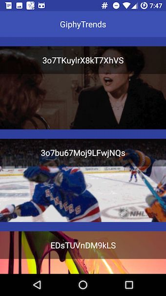
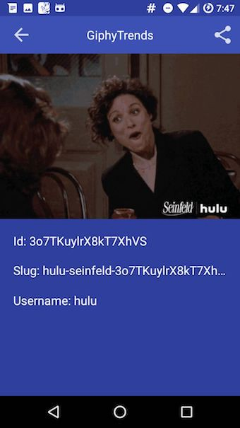
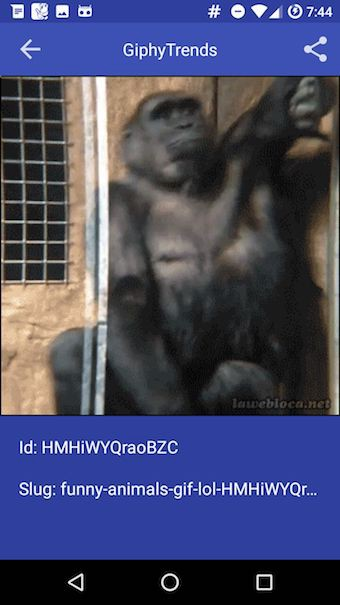

In the last tutorial we’ve started our “dummy” project GiphyTrends, that called
Giphy’s public REST API to get the data using two approaches:

1.  Android SDK approach : We used *AsyncTask* to perform the blocking operation in
a background thread, *HttpURLConnection* to perform the network task, and
*“org.json” *to deserialize manually the response.
1.  Third-party library approach: We set up Retrofit to perform the tasks, and Gson
to be the serializer.

The problem is we still have this horrible UI, showing raw API response data:


In this tutorial we will take care of the View layer to be able to show real
content to the user. But first, since we’ll be adding more code to the project,
we should re-arrange its architecture. At this point, all logic is performed
from a single place (MainActivity), which is not a very good idea if we want to
scale. So lets change this to a cleaner MVP architecture. We’ll first create a
Contract for both screens (the List and the Detail), that will define the
expected behavior of its correspondent presenter and view. A “BaseContract” is
used to define common methods, such as view-component lifecycle updates. This is
how our “GifListContract” interface looks:

```java
package com.example.androidlibsexample.presenter.contract;

import com.example.androidlibsexample.model.entities.Gif;
import com.example.androidlibsexample.model.entities.GiphyServiceResponse;

public interface GifListContract {

    interface View {

        void setLoadingIndicator(boolean active);

        void showGifList(GiphyServiceResponse response);

        void showGifDetails(String id);

    }

    interface Presenter extends BaseContract.Presenter {

        void loadGifs();

        void showGifDetails(Gif gif);

    }

}
```

After creating our Contracts, Presenters and Fragments we will setup a
repository class. Using the repository pattern you would expect to create at
least two different data-sources, such as a local Database and a remote API, but
since we’re not using local data (yet) we’re only creating the repository as an
abstraction layer to get the data from API. Our repository will be a Singleton
because we don’t really need more than one instance of this class.

```java
package com.example.androidlibsexample.model.repository;

import android.content.Context;
import android.widget.TextView;
import android.widget.Toast;

import com.example.androidlibsexample.R;
import com.example.androidlibsexample.model.entities.Gif;
import com.example.androidlibsexample.model.entities.GiphyServiceResponse;
import com.example.androidlibsexample.model.task.FetchGiphyTrendsTask;

public class GifRepository {

    private static GifRepository INSTANCE;

    private GifRepository() { }

    public static GifRepository getInstance(){
        if (INSTANCE == null){
            INSTANCE = new GifRepository();
        }

        return INSTANCE;
    }

    public void retrieveTrendGifs(Context context, FetchGiphyTrendsTask.OnLoadListener callback){

        FetchGiphyTrendsTask fetchGiphyTrendsTask = new FetchGiphyTrendsTask(context, callback);

        fetchGiphyTrendsTask.execute();

    }

}
```

Now we’re ready to implement our views. A couple of things to consider:

* We will build the same features using the same two approaches we already used in
the first tutorial (Android SDK vs “third-party libraries”)
* All approaches will use a third-party library called “Glide” to fetch and
display images. From my perspective, I don’t see why I would want to implement
an Image manipulation library myself.

### Implementing without extra libraries

In Android development you probably know that we constantly use “findViewById()”
to find our XML-defined views and control them from the correspondent Java
component. This “standard” way of relating the view to its logic gives you full
control of your layouts. Let’s see how we implement some basic code in our
Fragments and out list adapter:

```java
package com.example.androidlibsexample.view.fragment;

import android.content.Intent;
import android.os.Bundle;
import android.support.annotation.Nullable;
import android.support.v4.app.Fragment;
import android.support.v7.widget.Toolbar;
import android.view.LayoutInflater;
import android.view.View;
import android.view.ViewGroup;
import android.widget.ImageView;
import android.widget.TextView;

import com.bumptech.glide.Glide;
import com.bumptech.glide.load.engine.DiskCacheStrategy;
import com.example.androidlibsexample.R;
import com.example.androidlibsexample.model.entities.Gif;
import com.example.androidlibsexample.model.repository.GifRepository;
import com.example.androidlibsexample.presenter.GifDetailsPresenter;
import com.example.androidlibsexample.presenter.contract.GifDetailsContract;

/**
 * Created by agustinaliaga on 3/19/17.
 */

public class GifDetailsFragment extends Fragment implements GifDetailsContract.View {

    private GifDetailsPresenter presenter;
    private ImageView gifImage;
    private TextView gifId;
    private TextView gifSlug;
    private TextView gifUser;
    private Toolbar toolbar;
    private ImageView back;
    private ImageView share;

    public Gif getCurrentGif() {
        return presenter.getGif();
    }

    public void setPresenter(GifDetailsPresenter presenter) {
        this.presenter = presenter;
    }

    public void setCurrentGif(Gif currentGif) {
        presenter.setGif(currentGif);
    }

    @Override
    public void onCreate(@Nullable Bundle savedInstanceState) {
        super.onCreate(savedInstanceState);

        if (presenter != null) {
            presenter.create();
        }
    }

    @Nullable
    @Override
    public View onCreateView(LayoutInflater inflater, @Nullable ViewGroup container, @Nullable Bundle savedInstanceState) {
        return inflater.inflate(R.layout.fragment_gif_details, container, false);
    }

    @Override
    public void onViewCreated(View view, @Nullable Bundle savedInstanceState) {
        super.onViewCreated(view, savedInstanceState);

        gifImage = (ImageView) view.findViewById(R.id.gifDetailImage);
        gifSlug = (TextView) view.findViewById(R.id.gifSlug);
        gifId = (TextView) view.findViewById(R.id.gifId);
        gifUser = (TextView) view.findViewById(R.id.gifUser);
        toolbar = (Toolbar) view.findViewById(R.id.toolbar);

        back = (ImageView) view.findViewById(R.id.back);
        share = (ImageView) view.findViewById(R.id.share);

        back.setOnClickListener(new View.OnClickListener() {
            @Override
            public void onClick(View view) {
                getFragmentManager().popBackStack();
            }
        });

        share.setOnClickListener(new View.OnClickListener() {
            @Override
            public void onClick(View view) {
                Intent sendIntent = new Intent();
                sendIntent.setAction(Intent.ACTION_SEND);
                sendIntent.putExtra(Intent.EXTRA_TEXT,
                        presenter.getGif().getImages().getDownsized().getUrl());
                sendIntent.setType("text/plain");
                startActivity(sendIntent);
            }
        });

        Gif currentGif = presenter.getGif();

        if (currentGif != null) {
            Glide.with(getContext())
                    .load(currentGif.getImages().getDownsized().getUrl())
                    .asGif()
                    .crossFade()
                    .diskCacheStrategy(DiskCacheStrategy.SOURCE)
                    .into(gifImage);

            if (currentGif.getId() != null && !currentGif.getId().isEmpty()){
                gifId.setText("Id: " + currentGif.getId());
            }
            if (currentGif.getSlug() != null && !currentGif.getSlug().isEmpty()){
                gifSlug.setText("Slug: " + currentGif.getSlug());
            }
            if (currentGif.getUsername() != null && !currentGif.getUsername().isEmpty()){
                gifUser.setText("User: " + currentGif.getUsername());
            }
        }

        setRetainInstance(true);

    }

    @Override
    public void onStart() {
        super.onStart();

        if (presenter != null) {
            presenter.start();
        }
    }

    @Override
    public void onStop() {
        super.onStop();

        if (presenter != null) {
            presenter.stop();
        }
    }

    @Override
    public void onDestroy() {
        super.onDestroy();

        if (presenter != null) {
            presenter.destroy();
        }
    }
}
```
<br/>

```java
package com.example.androidlibsexample.view.adapter;

import android.content.Context;
import android.graphics.Bitmap;
import android.graphics.drawable.BitmapDrawable;
import android.graphics.drawable.Drawable;
import android.view.LayoutInflater;
import android.view.View;
import android.view.ViewGroup;
import android.widget.AdapterView;
import android.widget.BaseAdapter;
import android.widget.ImageView;
import android.widget.TextView;

import com.bumptech.glide.Glide;
import com.bumptech.glide.Priority;
import com.bumptech.glide.load.engine.DiskCacheStrategy;
import com.bumptech.glide.load.resource.gif.GifDrawable;
import com.bumptech.glide.request.animation.GlideAnimation;
import com.bumptech.glide.request.target.SimpleTarget;
import com.example.androidlibsexample.R;
import com.example.androidlibsexample.model.entities.Gif;

import java.util.ArrayList;
import java.util.List;

/**
 * Created by agustinaliaga on 3/19/17.
 */

public class GifListAdapter extends BaseAdapter {

    private List<Gif> gifsCollection = new ArrayList<>();
    private Context context;
    private GifSelectionListener listener;

    public GifListAdapter(Context context){
        this.context = context;
    }

    public void updateDataSource(List<Gif> gifs){
        gifsCollection = gifs;
        notifyDataSetChanged();
    }

    public void setListener(GifSelectionListener listener) {
        this.listener = listener;
    }

    @Override
    public int getCount() {
        return gifsCollection.size();
    }

    @Override
    public Object getItem(int i) {
        return gifsCollection.get(i);
    }

    @Override
    public long getItemId(int i) {
        return gifsCollection.get(i).hashCode();
    }

    @Override
    public View getView(int i, View convertView, ViewGroup viewGroup) {
        final ViewHolder viewHolder;

        if (convertView == null) {
            convertView = LayoutInflater.from(context).inflate(R.layout.item_gif_list, viewGroup, false);
            viewHolder = new ViewHolder(convertView);
            convertView.setTag(viewHolder);
        } else {
            viewHolder = (ViewHolder) convertView.getTag();
        }

        final Gif currentItem = (Gif) getItem(i);

        Glide.with(context)
                .load(currentItem.getImages().getDownsized().getUrl())
                .asGif()
                .crossFade()
                .centerCrop()
                .diskCacheStrategy(DiskCacheStrategy.SOURCE)
                .into(viewHolder.gifImage);

        viewHolder.titleView.setText(currentItem.getId());

        viewHolder.gifImage.setOnClickListener(new View.OnClickListener() {
            @Override
            public void onClick(View view) {
                if (listener != null){
                    listener.onGifSelected(currentItem);
                }
            }
        });

        return convertView;
    }

    private class ViewHolder {
        ImageView gifImage;
        TextView titleView;

        public ViewHolder(View view) {
            gifImage = (ImageView) view.findViewById(R.id.gifImage);
            titleView = (TextView) view.findViewById(R.id.titleView);
        }
    }

    public interface GifSelectionListener {

        void onGifSelected(Gif gif);
    }
}
```

Our app now looks like this:





Not bad, but you can tell we’re using “findViewById()” way too much, or maybe
the fact that the code is quite long for such a simple task. Also, if you’re not
familiar with ListViews in Android, you’ll probably look at our “getView()”
method in the list adapter and think “what the hell is a convertView or a
viewHolder?”. It actually is an interesting solution to keep the app
memory-efficient when loading a long list with a lot of data to render. Instead
of inflating the views for each row, it will only inflate a couple and then
reuse them as the user scrolls down. The problem is that it is not so easy to
remember how to code this pattern. Let’s see how third-party libraries helps us
solve these issues.

### Using ButterKnife, Data-Binding Library and RecyclerView

All the nice control you have with the standard approach of binding views comes
with a price. Java code is not famous for being super readable, but rather quite
complex and verbose. Also, when you want to communicate user-input events to the
correspondent component you may have to use “Listeners” as callbacks and if
you’re building complex views or complex behavior the final code will be really
long and hard to maintain . After working some time with Android I realized that
all this glue code is too much repetitive, always the same. It gets to a point
that it’s not only boring to write boilerplate code, but also unproductive.

#### Data-Binding Library

Here’s where declarative programming comes handy. There are a couple of
interesting libraries that solve these problems (and much more) with different
perspectives and patterns. One example of this is the “Data Binding Library”
created by Google, which you can easily use importing the Support Library into
your project. With this library you’ll be able to bind XML views to data models
in a declarative way, writing small expressions into the layout that define how
your views will display the information. No more “findViewById()” or boilerplate
code with declarative layouts. So, why isn’t everybody using the Data Binding
Library ? Well … One common opinion is that it comes with a performance cost of
your application if you don’t use it right or if your layouts are way too
complicated, but I need to do further investigation on this one. Another common
opinion is that the architectural decision of inserting “logic code” into the
layouts themself is not a good idea. Creating tests with this kind of
architecture is probably harder with all these expressions inside the view
itself, and layouts would become less reusable since they are bound to a
specific data model. Adding the library to our project as well as using it is
extremely simple. You just have to define the model to which your layout will
link, and then write small expressions in your XML to bind data. Then from the
Fragment/Activity set the object to be bound and you’re done. Here’s how our
layout looks like (notice the expression to check if the object’s attributes are
not empty):

```xml
<?xml version="1.0" encoding="utf-8"?>
<layout xmlns:android="http://schemas.android.com/apk/res/android">
    <data>
        <variable name="gif" type="com.example.androidlibsexample.model.entities.Gif"/>
        <import type="android.view.View"/>
    </data>
<ScrollView android:layout_width="match_parent"
    android:layout_height="match_parent"
    android:background="@color/colorPrimaryDark" >
<LinearLayout android:orientation="vertical"
    android:layout_width="match_parent"
    android:layout_height="match_parent">

    <android.support.v7.widget.Toolbar
        android:id="@+id/toolbar"
        android:background="@color/colorPrimary"
        android:layout_width="match_parent"
        android:layout_height="wrap_content">

        <ImageView
            android:id="@+id/back"
            android:src="@drawable/ic_back"
            android:paddingRight="10dp"
            android:layout_width="wrap_content"
            android:layout_height="match_parent" />

        <TextView
            android:text="GiphyTrends"
            android:textColor="@android:color/white"
            android:textSize="18sp"
            android:layout_gravity="center"
            android:layout_width="wrap_content"
            android:layout_height="wrap_content" />

        <ImageView
            android:id="@+id/share"
            android:src="@drawable/ic_share"
            android:layout_gravity="right"
            android:paddingRight="10dp"
            android:paddingLeft="10dp"
            android:layout_width="wrap_content"
            android:layout_height="match_parent" />

    </android.support.v7.widget.Toolbar>

    <ImageView
        android:id="@+id/gifDetailImage"
        android:layout_width="match_parent"
        android:layout_height="wrap_content" />

    <TextView
        android:id="@+id/gifId"
        android:text="@{`Id: ` + gif.id}"
        android:textColor="@android:color/white"
        android:textSize="18sp"
        android:layout_marginTop="20dp"
        android:layout_marginLeft="20dp"
        android:layout_marginRight="20dp"
        android:lines="1"
        android:visibility="@{gif.id.empty ? View.GONE : View.VISIBLE}"
        android:ellipsize="end"
        android:layout_width="match_parent"
        android:layout_height="wrap_content" />

    <TextView
        android:id="@+id/gifSlug"
        android:text="@{`Slug: ` + gif.slug}"
        android:textColor="@android:color/white"
        android:textSize="18sp"
        android:layout_marginLeft="20dp"
        android:layout_marginTop="20dp"
        android:layout_marginRight="20dp"
        android:lines="1"
        android:visibility="@{gif.slug.empty ? View.GONE : View.VISIBLE}"
        android:ellipsize="end"
        android:layout_width="match_parent"
        android:layout_height="wrap_content" />

    <TextView
        android:id="@+id/gifUser"
        android:text="@{`Username: ` + gif.username}"
        android:textColor="@android:color/white"
        android:textSize="18sp"
        android:layout_marginLeft="20dp"
        android:layout_marginTop="20dp"
        android:layout_marginRight="20dp"
        android:lines="1"
        android:visibility="@{gif.username.empty ? View.GONE : View.VISIBLE}"
        android:ellipsize="end"
        android:layout_width="match_parent"
        android:layout_height="wrap_content" />


</LinearLayout>
</ScrollView>
</layout>
```

And the resulting layout (evaluating all expressions inside the view):



#### Butterknife

This is a really cool library that defines itself as *“Field and method binding
for Android views”*. This is exactly what it does. It binds component views and
methods to your layout. Similarly to Data-Binding it saves us from repeating
“findViewById()” code with the power of Annotations like @BindView, but in a
different way. It doesn’t really link the view to a data model, and you don’t
need to change anything in your XMLs. After setting this up, it will generate
all the necessary code “automagically”. It has a couple more features such as
optional bindings and multi-method listeners. Using both libraries our code
looks much more declarative, readable and clean.

```java
package com.example.androidlibsexample.view.fragment;

import android.content.Intent;
import android.databinding.DataBindingUtil;
import android.os.Bundle;
import android.support.annotation.Nullable;
import android.support.v4.app.Fragment;
import android.support.v7.widget.Toolbar;
import android.view.LayoutInflater;
import android.view.View;
import android.view.ViewGroup;
import android.widget.ImageView;

import com.bumptech.glide.Glide;
import com.bumptech.glide.load.engine.DiskCacheStrategy;
import com.example.androidlibsexample.R;
import com.example.androidlibsexample.databinding.FragmentGifDetailsBinding;
import com.example.androidlibsexample.model.entities.Gif;
import com.example.androidlibsexample.presenter.GifDetailsPresenter;
import com.example.androidlibsexample.presenter.contract.GifDetailsContract;

import butterknife.BindView;
import butterknife.ButterKnife;
import butterknife.OnClick;

/**
 * Created by agustinaliaga on 3/19/17.
 */

public class GifDetailsFragment extends Fragment implements GifDetailsContract.View {

    private GifDetailsPresenter presenter;

    @BindView(R.id.gifDetailImage) ImageView gifDetailImage;
    @BindView(R.id.toolbar) Toolbar toolbar;
    @BindView(R.id.share) ImageView share;
    @BindView(R.id.back) ImageView back;

    public Gif getCurrentGif() {
        return presenter.getGif();
    }

    public void setPresenter(GifDetailsPresenter presenter) {
        this.presenter = presenter;
    }

    public void setCurrentGif(Gif currentGif) {
        presenter.setGif(currentGif);
    }

    @Override
    public void onCreate(@Nullable Bundle savedInstanceState) {
        super.onCreate(savedInstanceState);

        if (presenter != null) {
            presenter.create();
        }
    }

    @Nullable
    @Override
    public View onCreateView(LayoutInflater inflater, @Nullable ViewGroup container, @Nullable Bundle savedInstanceState) {

        FragmentGifDetailsBinding binding = DataBindingUtil.inflate(
                getLayoutInflater(savedInstanceState),
                R.layout.fragment_gif_details,
                container,
                false
        );

        binding.setGif(presenter.getGif());

        View view = binding.getRoot();

        ButterKnife.bind(this, view);

        return view;
    }

    @Override
    public void onViewCreated(View view, @Nullable Bundle savedInstanceState) {
        super.onViewCreated(view, savedInstanceState);

        Gif currentGif = presenter.getGif();

        if (currentGif != null) {
            Glide.with(getContext())
                    .load(currentGif.getImages().getDownsized().getUrl())
                    .asGif()
                    .crossFade()
                    .diskCacheStrategy(DiskCacheStrategy.SOURCE)
                    .into(gifDetailImage);
        }

        setRetainInstance(true);
    }

    @OnClick(R.id.share)
    public void onShare(){
        Intent sendIntent = new Intent();
        sendIntent.setAction(Intent.ACTION_SEND);
        sendIntent.putExtra(Intent.EXTRA_TEXT,
                presenter.getGif().getImages().getDownsized().getUrl());
        sendIntent.setType("text/plain");
        startActivity(sendIntent);
    }

    @OnClick(R.id.back)
    public void onBack(){
        getFragmentManager().popBackStack();
    }

    @Override
    public void onStart() {
        super.onStart();

        if (presenter != null) {
            presenter.start();
        }
    }

    @Override
    public void onStop() {
        super.onStop();

        if (presenter != null) {
            presenter.stop();
        }
    }

    @Override
    public void onDestroy() {
        super.onDestroy();

        if (presenter != null) {
            presenter.destroy();
        }
    }
}
```

Remember we talked about the ViewHolder pattern used in Android ListViews? I
added another component from the support library called “RecyclerView”. It will
basically use the same pattern but in a cleaner way, so that we can implement it
without having to remember the “convertView” way of doing it. Also, we’ve set up
ButterKnife in the list adapter itself.

```java
package com.example.androidlibsexample.view.adapter;

import android.content.Context;
import android.support.v7.widget.RecyclerView;
import android.view.LayoutInflater;
import android.view.View;
import android.view.ViewGroup;
import android.widget.BaseAdapter;
import android.widget.ImageView;
import android.widget.TextView;

import com.bumptech.glide.Glide;
import com.bumptech.glide.load.engine.DiskCacheStrategy;
import com.example.androidlibsexample.R;
import com.example.androidlibsexample.model.entities.Gif;

import java.util.ArrayList;
import java.util.List;

import butterknife.BindView;
import butterknife.ButterKnife;

/**
 * Created by agustinaliaga on 3/23/17.
 */

public class GifListAdapter extends RecyclerView.Adapter<GifListAdapter.ViewHolder> {

    private List<Gif> gifsCollection = new ArrayList<>();
    private Context context;
    private GifSelectionListener listener;

    public GifListAdapter(Context context){
        this.context = context;
    }

    public void updateDataSource(List<Gif> gifs){
        gifsCollection = gifs;
        notifyDataSetChanged();
    }

    public void setListener(GifSelectionListener listener) {
        this.listener = listener;
    }


    @Override
    public ViewHolder onCreateViewHolder(ViewGroup parent, int viewType) {
        View view = LayoutInflater.from(context).inflate(R.layout.item_gif_list, parent, false);
        return  new ViewHolder(view);
    }

    @Override
    public void onBindViewHolder(ViewHolder holder, int position) {

        final Gif currentItem = gifsCollection.get(position);

        Glide.with(context)
                .load(currentItem.getImages().getDownsized().getUrl())
                .asGif()
                .crossFade()
                .centerCrop()
                .diskCacheStrategy(DiskCacheStrategy.SOURCE)
                .into(holder.gifImage);

        holder.titleView.setText(currentItem.getId());

        holder.gifImage.setOnClickListener(new View.OnClickListener() {
            @Override
            public void onClick(View view) {
                if (listener != null){
                    listener.onGifSelected(currentItem);
                }
            }
        });
    }

    @Override
    public int getItemCount() {
        return gifsCollection.size();
    }

    class ViewHolder extends RecyclerView.ViewHolder {
        @BindView(R.id.gifImage) ImageView gifImage;
        @BindView(R.id.titleView) TextView titleView;

        public ViewHolder(View view) {
            super(view);
            ButterKnife.bind(this, view);
        }
    }

    public interface GifSelectionListener {

        void onGifSelected(Gif gif);
    }
}
```

#### Conclusion

We’ve created a very simple example of how to create Android layouts with and
without third-party dependencies. You will know if Butterknife and/or
Data-Binding are worth adding to your project. In the next tutorial (part III)
we’ll save a “favorite GIF” locally. We’ll follow the same approach as here, and
check out how we can do this natively (with SQLite and Content Providers) as
well as using third-party projects (maybe an ORM, maybe Realm).

Remember you can clone/fork the project here:
[https://github.com/agustinaliagac/GiphyTrends-AndroidExamples](https://github.com/agustinaliagac/GiphyTrends-AndroidExamples)
