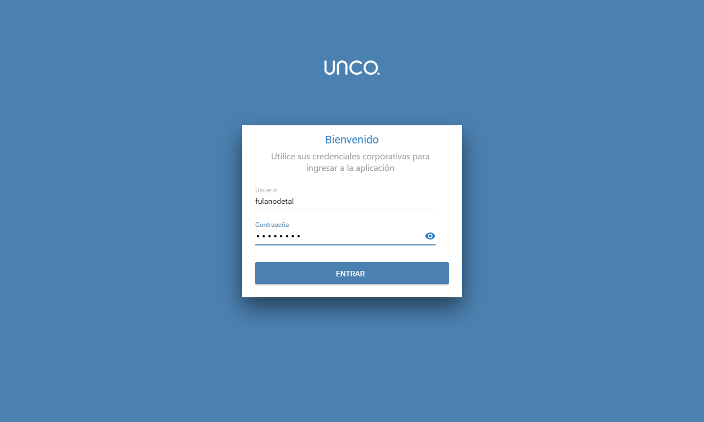
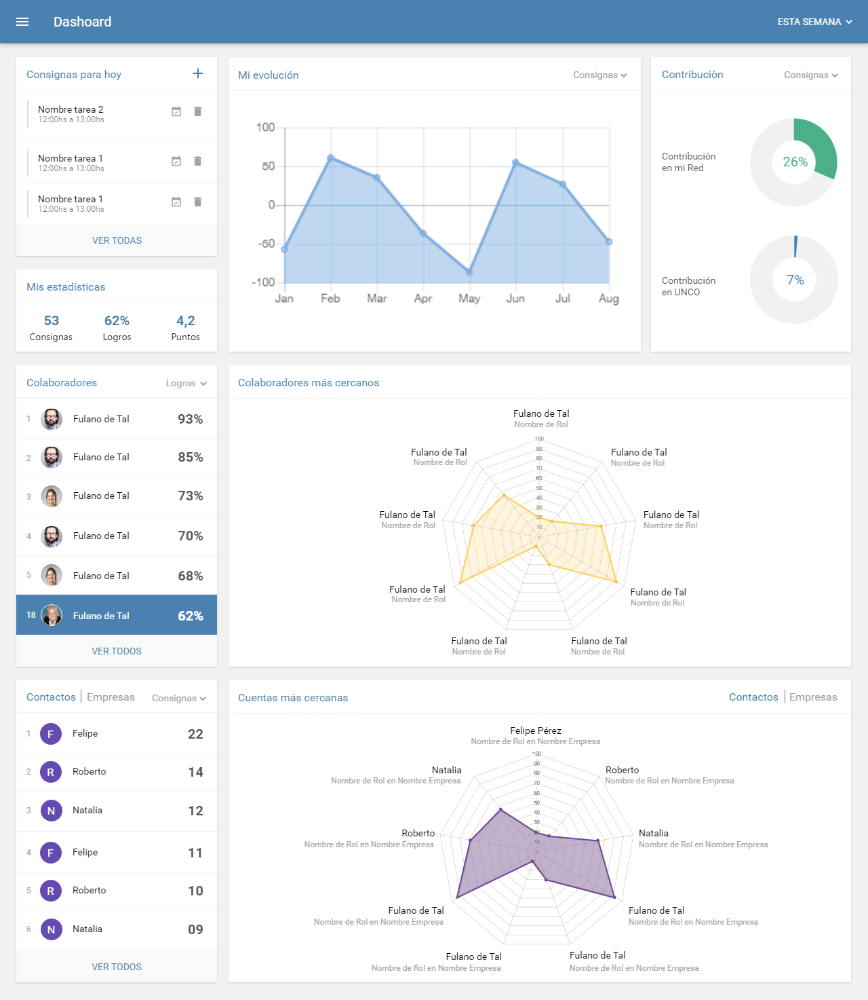
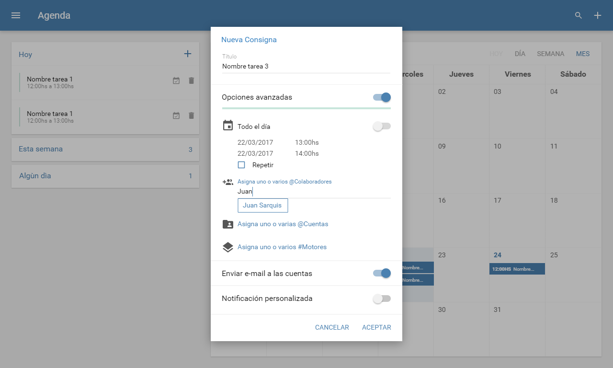

 
AGD is a large local company in the farming / food business. The final users of this app use it to synchronize business events in a calendar. I contributed to the project by working on every aspect of the front end side of the application. This means working in two separate projects (Angular 2 for web, and Ionic Framework for mobile/web). Collaborated with a small team (1 other front end dev, 1 back end dev, 1 pm, 1 product owner).

The app involved consuming services, handling dates for calendarized events, synchronizing offline data, and basic stuff like profile creation.

#### Tech stack
Typescript, Javascript, Angular 2, Ionic Framework 2

#### URL
https://play.google.com/store/apps/details?id=ar.com.agd.agendaunco

#### Screenshots

