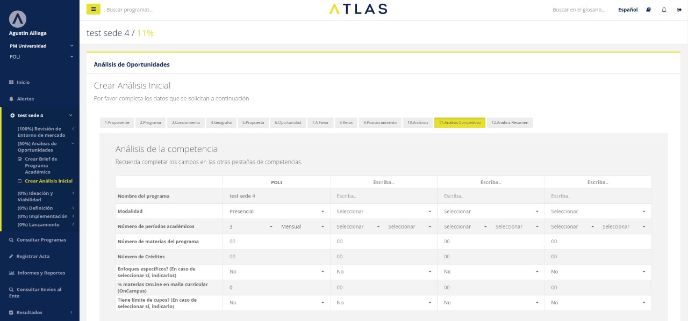
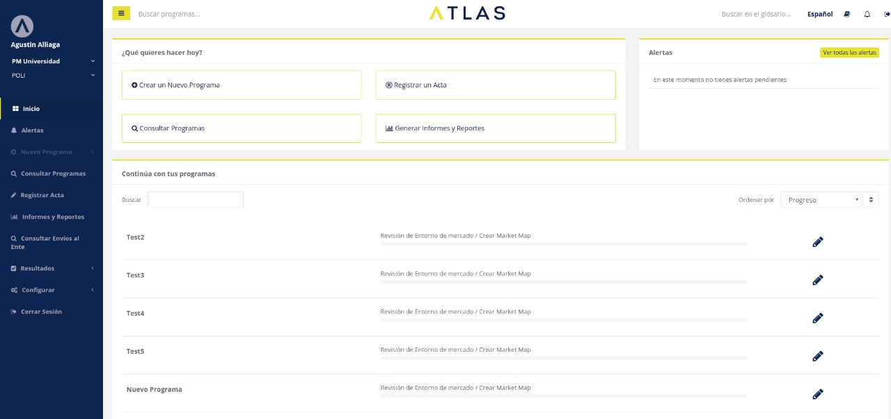
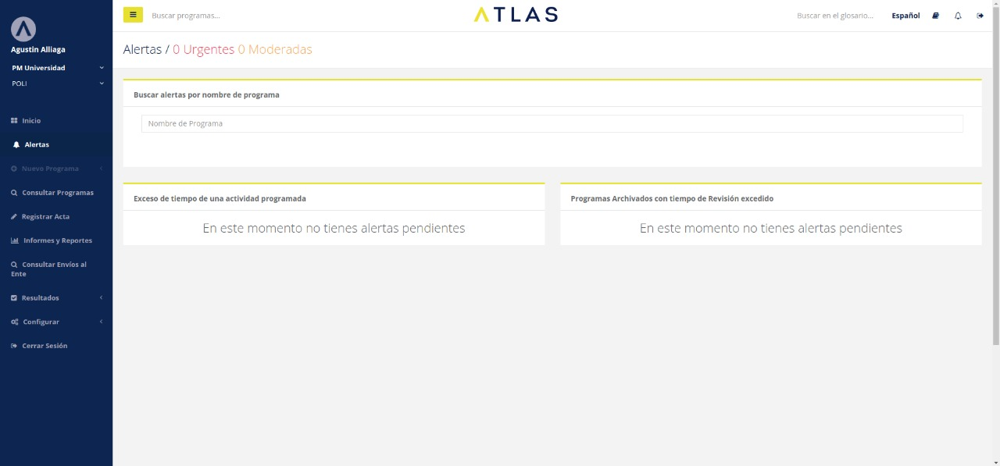

 
Ilumno is a company that brings together 14 universities from Latin America and provides software solutions to common problems. I participated on a specific product called Atlas designed to control the lifespan of academic programs. It manages a complex workflow, and renders dynamic forms at different product phases.

#### Tech stack
AngularJS, HTML5, CSS3, Grunt, Workflows, Dynamic forms

#### Screenshots

