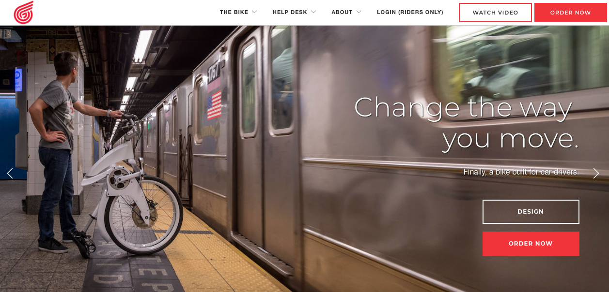
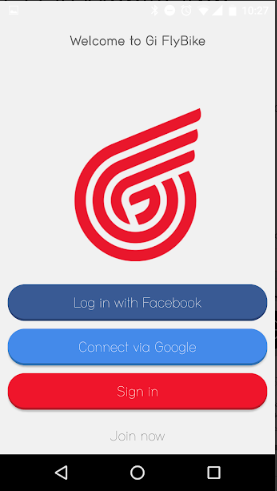
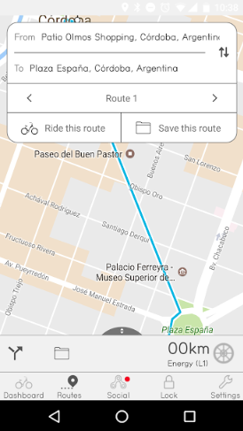
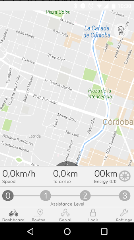
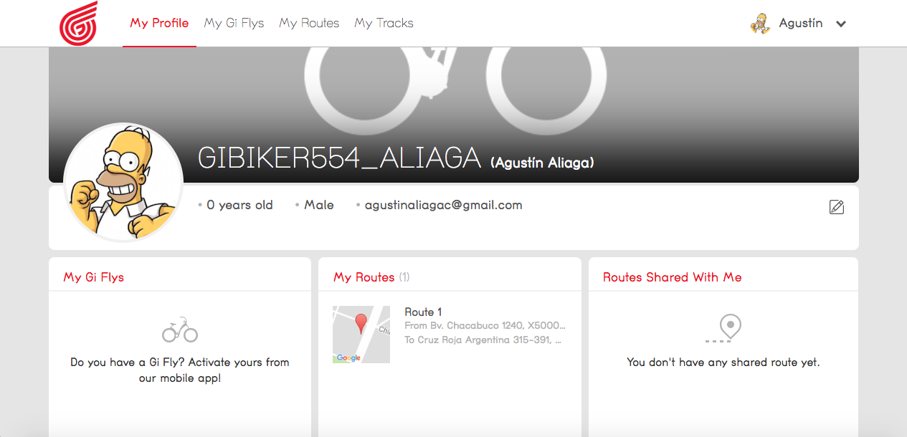

 
A mobile app for an e-bike. With this app, the user can activate it securely (using Bluetooth low energy), control its lights, assistance levels and lock system.
It incorporates an auto-locking feature when the user walks away from the bike, and a Track saving feature using geo-localization.
I also collaborated on the web platform for both back end tasks and front end.

#### Tech stack
Android, Java, Bluetooth Low Energy, Firmware manipulation, AngularJS, Flask, Python, Javascript

#### Screenshots

