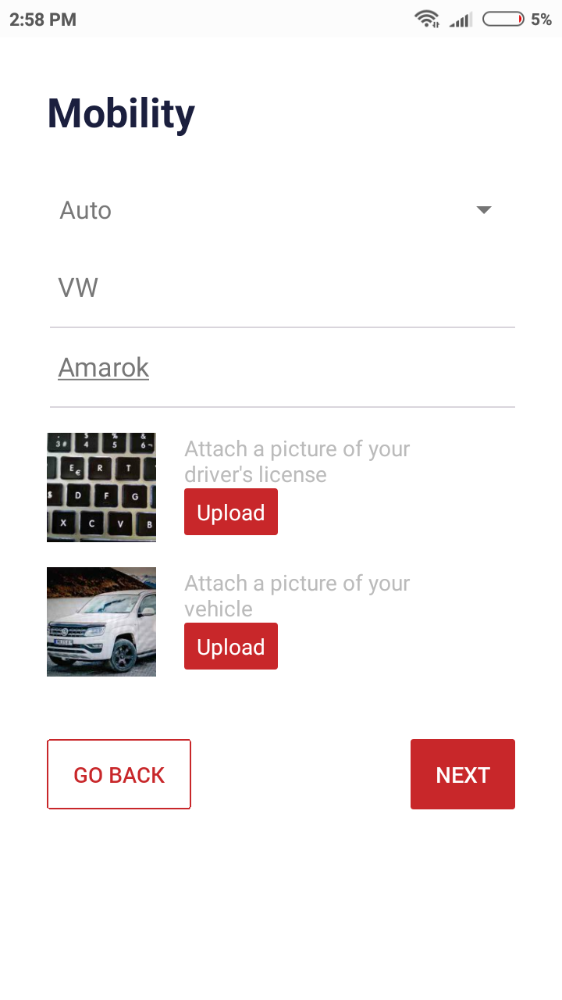
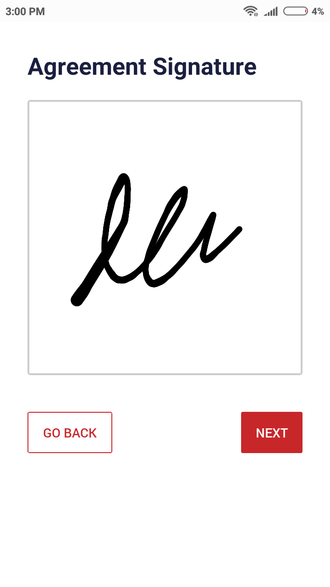
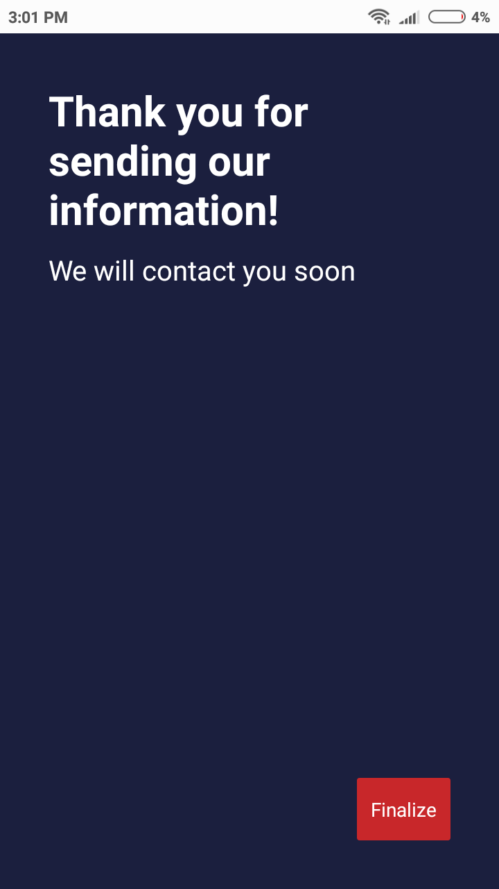

 
RapiHogar is a local startup that allows people to quickly find professionals for common home problems.
I created an intro wizard for workers to register their accounts. It handles offline data (redux-persist), forms, image uploads, signatures, API interacation and navigation. I also fixed some bugs by enforcing best practices, improving the app's overall performance. Improved code quality by adding standard ESLint configs.

#### Tech stack
Javascript (ES2015), React Native, Redux, Redux Saga, Redux Persist, React Navigation

#### Screenshots

#### URL
https://www.rapihogar.com.ar