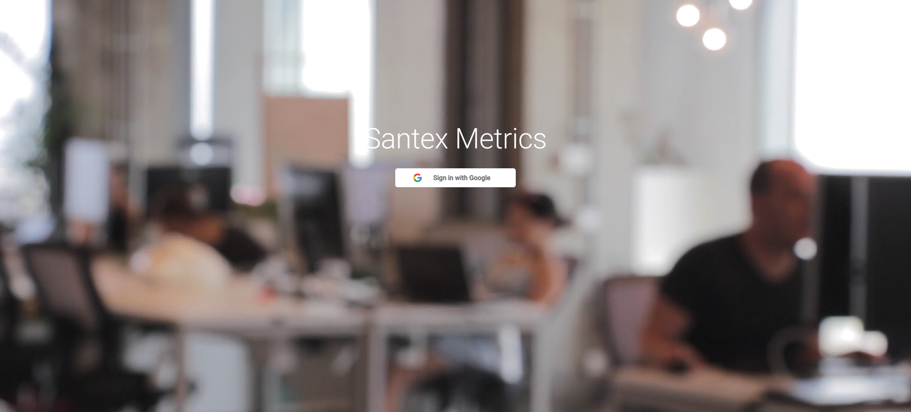
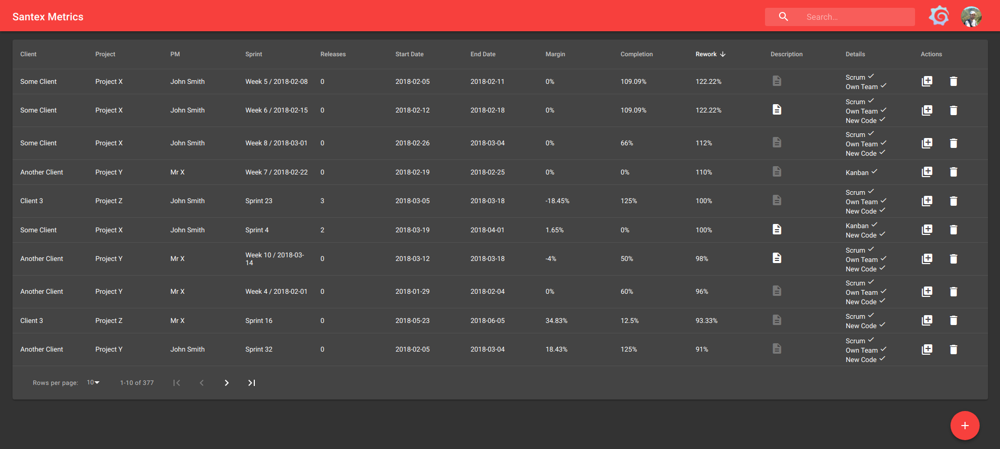
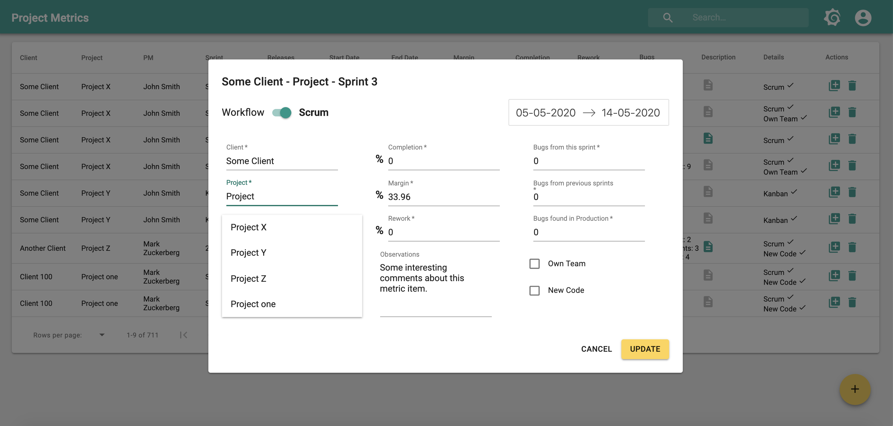

 
Web application that allows PMs to track their project's metrics (rework, completion, margin, release count, etc.). These metrics are visualized afterwards in another platform called Grafana. It was a good opportunity for me to start learning GraphQL and Apollo.
This small (but end-to-end app) handles data queries and mutations, customized authentication through Firebase, local sorting and filtering, and a good number of customized components. It was also a good place to start playing with functional programming concepts.
All the data is sorted, and filtered through data pipelines which are composed curried functions with lodash/fp.

#### Tech stack
Javascript (ES2015), React.js, Node.js, GraphQL, Apollo, ESLint, Lodash FP, Firebase Auth, MySQL, Sequelize ORM, Functional Programming

#### Screenshots

