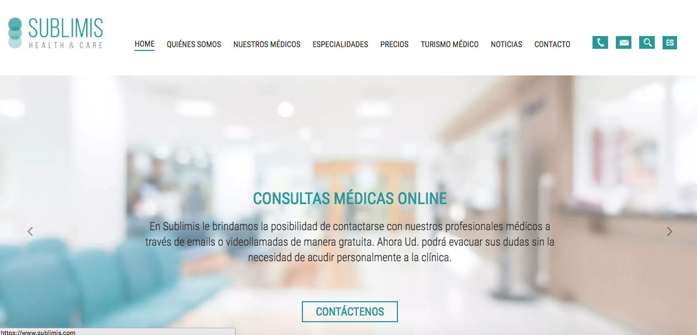

 
Sublimis is a website that relies on SEO to get clients for surgeons and clinics in Argentina. It handles a good amount of daily visitors.
I collaborated in the project setting up all the required infrastructure for the web app (which is mostly a Laravel app) to run smoothly. This involved customizing caching to increase page load, configuring some Apache modules, configuring AWS SES, building and running Docker containers and setting up SSL certificates (among other tasks).

#### Tech stack
Docker, Docker Compose, Apache

#### Screenshots

